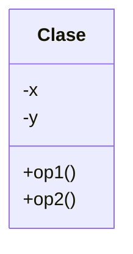

# Ejercicio-Autograding para C++ usando Catch2

**Fuente:** *Learning Autograding with C/C++ and Catch2 - Prof. Igor Machado Coelho* 
https://medium.com/swlh/easy-c-autograding-on-github-classroom-with-catch2-106ad1107402

## Descripción del Problema

Esta parte describe la actividad. Esta actividad ejemplo consiste en arreglar dos funciones: una que suma dos enteros, otra que multiplica dos enteros.

## Ejecución

El programa debe mostrar la siguiente ejecución:

```
Dame el valor de X: X
Dame el valor de Y: Y
El resultado es: Z 
```

## Diagrama de Clases

Construye aquí el Diagrama de Clases de tu solución, usando el [Lenguaje Mermaid](https://mermaid.js.org/syntax/classDiagram.html).


[Diagramas de clase en el lenguaje Mermaid](https://mermaid.js.org/syntax/classDiagram.html)

## Prompt para generar el Diagrama de Clases con IA - mermAID
```
@mermaid /uml
```
## Diagrama de clases UML con draw.io

El repositorio está configurado para crear Diagramas de clases UML con ```draw.io```. Para usarlo simplemente das doble clic en el archivo  ```uml.class.drawio.png``` y se activará el editor ```draw.io``` incrustado en ```VSCode``` para edición. Asegúrate de agregar las formas UML en el menú de formas del lado izquierdo (opción ```+Más formas```). Al final insertas el archivo ```uml.class.drawio.png``` en apartado de UML de este archivo README.

Para más información consulta el [MarketPlace](https://marketplace.visualstudio.com/items?itemName=hediet.vscode-drawio).

## Objetivo

- Busca que el código pase correctamente todas las pruebas
   * Solamente cambia los archivos permitidos para lograr este objetivo (abajo se indican las reglas específicas)
   
- Las GitHub Actions deberán presentar una palomita en verde si se han satisfecho todas las pruebas, y una cruz roja cuando alguna (o todas) las pruebas han fallado.
   * **Recomendación:** Puedes dar clic en la cruz roja para verificar cual de las pruebas ha fallado (o si el código no ha compilado correctamente).
   * **Recomendación:** En caso de que el Autograding no muestre pruebas o no funcione, contacta a tu profesor mediante un issue.

## Instrucciones

- Deberás modificar el archivo `exercise.cpp`  y agregar la programación adicional que sea necesaria.

Explicación de los otros archivos:

- Archivo `test/tests.cpp` tiene las pruebas de esta actividad (NO LO CAMBIES!)
- Archivo `test/catch.hpp` tiene la biblioteca de pruebas  CATCH2 (NO LA CAMBIES!)
- Archivo `makefile` tienes los comandos para ejecutar la actividad (NO LO CAMBIES!)
- Archivo  `./build/appTests` se generará después de compilar (para **pruebas locales**, solo ejecútalo)

## Comandos para pruebas locales, ejecución y depuración

- Comando para construir y ejecutar pruebas: `make` o `make test`
    * Si el ejecutable ya está construido, sólo teclea : `./build/appTests`

- Comando para construir y ejecutar la aplicación: `make run` 
    * Si el ejecutable ya está construido, sólo teclea : `./build/exercise`
      
- Comando para depurar: `make debug`
    * Para conocer los comandos de depuración consulta:
     https://u.osu.edu/cstutorials/2018/09/28/how-to-debug-c-program-using-gdb-in-6-simple-steps/

- Comando para depurar con `vsCode`: `make debugvs` 
    * Abre el programa principal.
    * Utiliza el depurador de la IDE.
      
- Comando para depurar pruebas con `vsCode`: `make debugtest` 
    * Abre el programa principal.
    * Utilizar el depurador de la IDE.
- Comando para limpieza de binarios `make clean`
    * Úselo cuando desee eliminar cualquier binario que se haya generado en la carpeta `build`.
    * Úselo cuando detecte que algún binario no está actualizado o bien no se hubiere construido conrrectamente.

## Instrucciones para construir y ejecutar la aplicación y pruebas usando CMake

1. Entrar al directorio de construcción:
   ```sh
   cd build
   ```

2. Configurar el proyecto con CMake:
   ```sh
   cmake -DTEST_EXECUTABLE=ON ..
   cmake -DMAIN_EXECUTABLE=ON ..
   ```

3. Construir la aplicación:
   ```sh
   cmake --build .
   ```

4. Ejecutar la aplicación:
   ```sh
   ./exercise
   cd ..
   ```
5. Ejecutar las pruebas:
   ```sh
   ./appTests
   cd ..
   ```
## Notas

- El código será evaluado solamente si compila.
   * La razón de esto es, si no compila no es posible generar el ejecutable y realizar las pruebas.

- Algunos casos de prueba podrían recibir calificación individual, otros podrían recibir calificación y si pasan todos juntos (o todas las pruebas en conjunto).

- La calificación final se otorgará de manera automática en cada *commit*, y se evaluará solamente hasta la fecha limite de la actividad.

Para dudas adicionales, consulta a tu profesor.

## License

MIT License 2020
